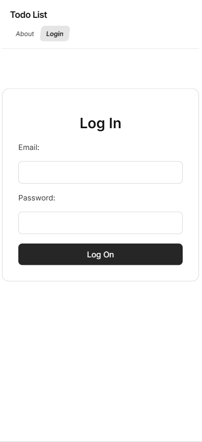
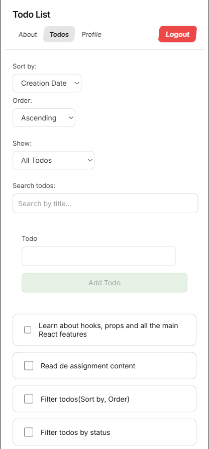
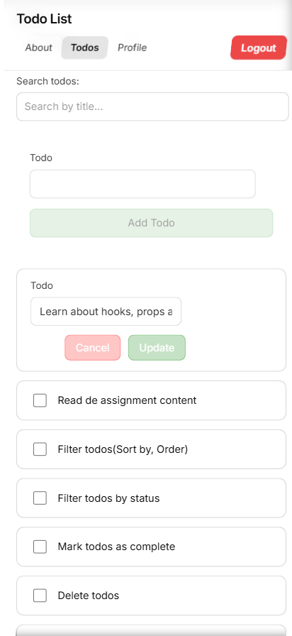
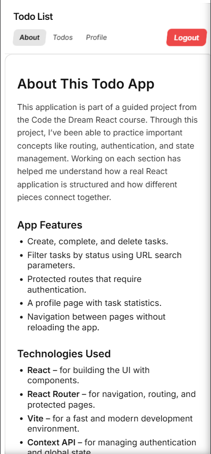
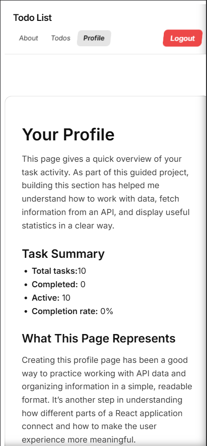
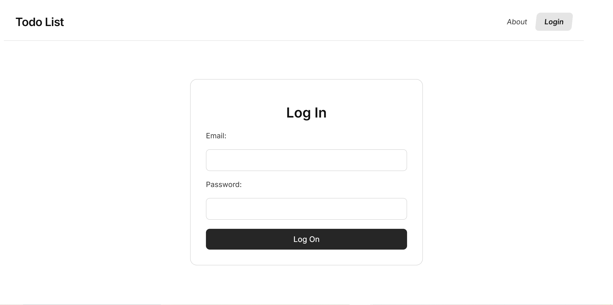
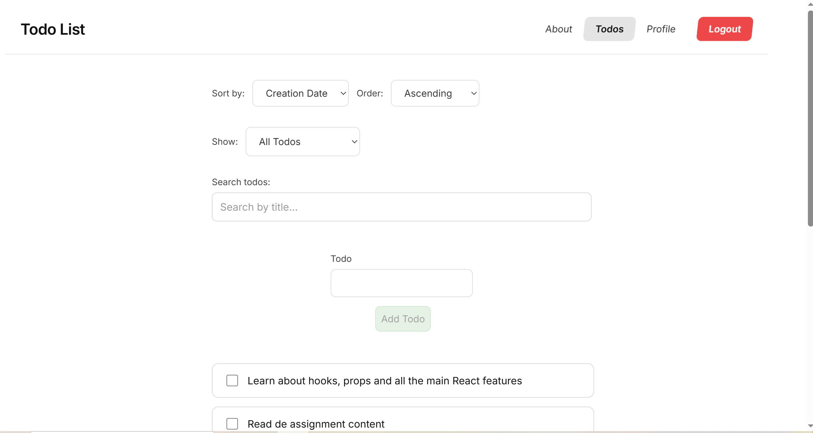
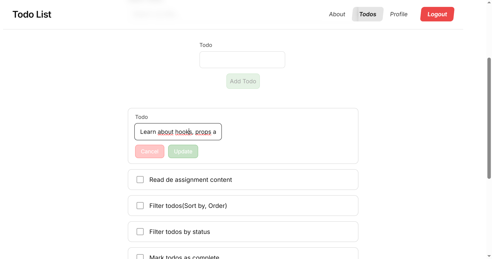
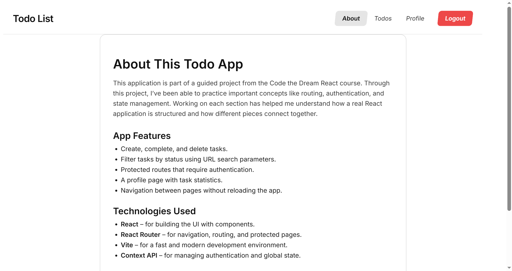
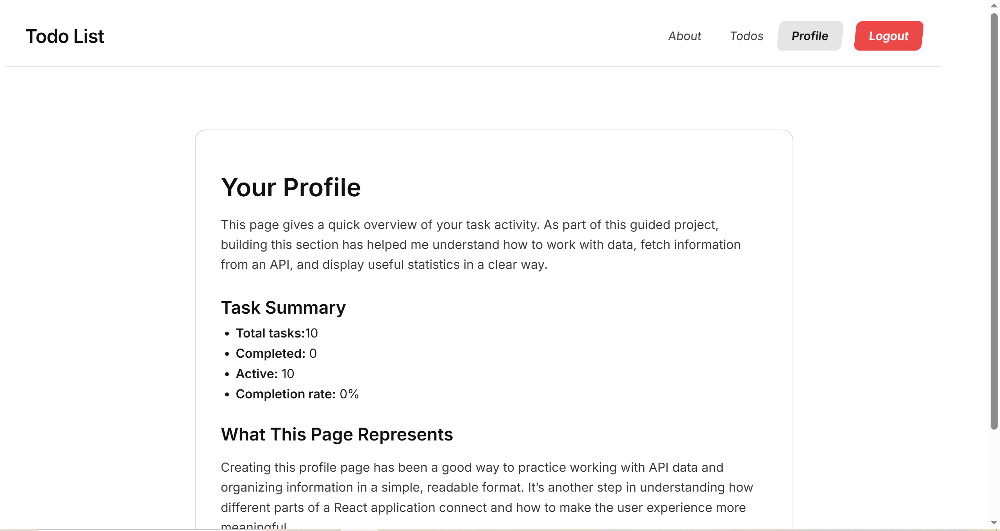

TODO-LIST APP - Fullstack React Project

A fullstack application built as part of my initial learning journey with React.
Throughout the development process, I implemented: task creation, editing, and deletion; dynamic filtering; API consumption using fetch; secure error handling; strict input sanitization; custom validations; advanced hooks and custom hooks; state management; protected routes with token‑based authentication; loading states; reusable components; responsive design with CSS Modules; and a clean, organized architecture following best practices.
This project helped me understand from scratch how all the pieces of a real-world application fit together, from frontend logic to backend communication.

LIVE DEMO 

FEATURES

-Login to an existing profile
-Add new todos
-Edit existing todos
-Mark todos as completed
-Filter todos (all, active, completed)
-Protected routes with authentication
-Profile page with task statistics
-Strict input sanitization using DOMPurify
-Secure error messaging (no system details exposed)
-Custom validations
-Loading states and visual feedback
-Responsive UI built with CSS Modules
-Custom hooks (e.g., useEditableTitle)

TECHNOLOGIES USED

-React (components, hooks, context)
-React Router (routing + protected routes)
-Vite (fast development environment)
-CSS Modules (scoped styling)
-DOMPurify (input sanitization)
-Fetch API (API communication)
-Node.js / Express (if your backend uses JS)
-JSON Web Tokens (JWT) (authentication)

SCREENSHOTS

MOBILE

DESKTOP

GETTING STARTED 

-Node.js (v18 or higher recommended)
-npm or yarn

Instructions

-Clone the repo to your local machine using the CLI:
  https://github.com/OsirisJEBJ/todo-list.git
-Install dependencies
 npm install
-Start the development server
  npm run dev
-Open the App in your browser

AVAILABLE SCRIPTS

-npm run dev  
 	Starts the Vite development server
-npm run build	
  Builds the production-ready version
-npm run preview	
  Previews the production build locally

DESING DECISIONS

-CSS Modules for clean, isolated styling
-Minimal, modern typography for a clean UI
-Accessible buttons and forms with disabled states and visual feedback
-Custom loading spinners for better UX
-Strict sanitization to prevent XSS attacks
-Safe error messages that avoid exposing system details
-Input length limits for better UX and security
-Reusable components and custom hooks for cleaner architecture

FUTURE IMPROVEMENTS

-Dark mode
-Drag & drop to reorder todos

LICENSE

this project is licensed under the MIT License.
You are free to use, modify, and distribute it.

CONTACT 

Osiris Estrada
GitHub: https://github.com/OsirisJEBJ